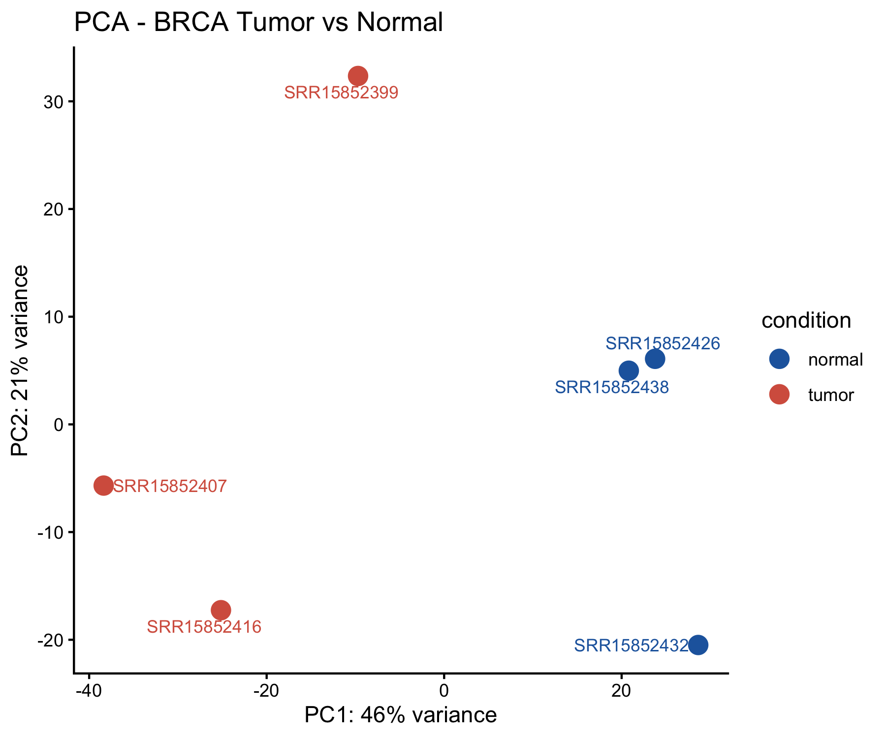
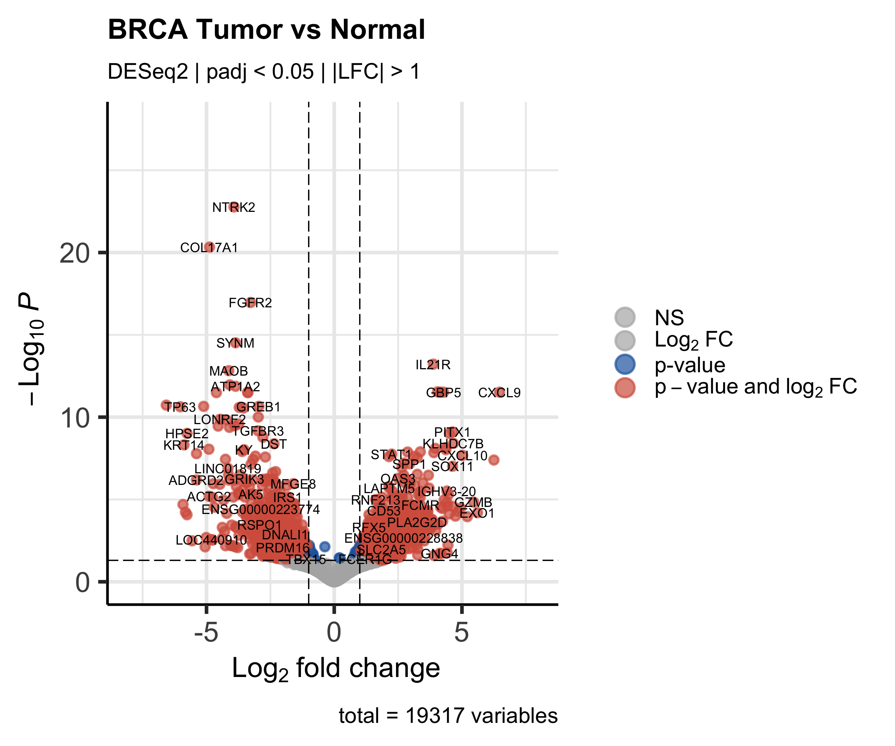
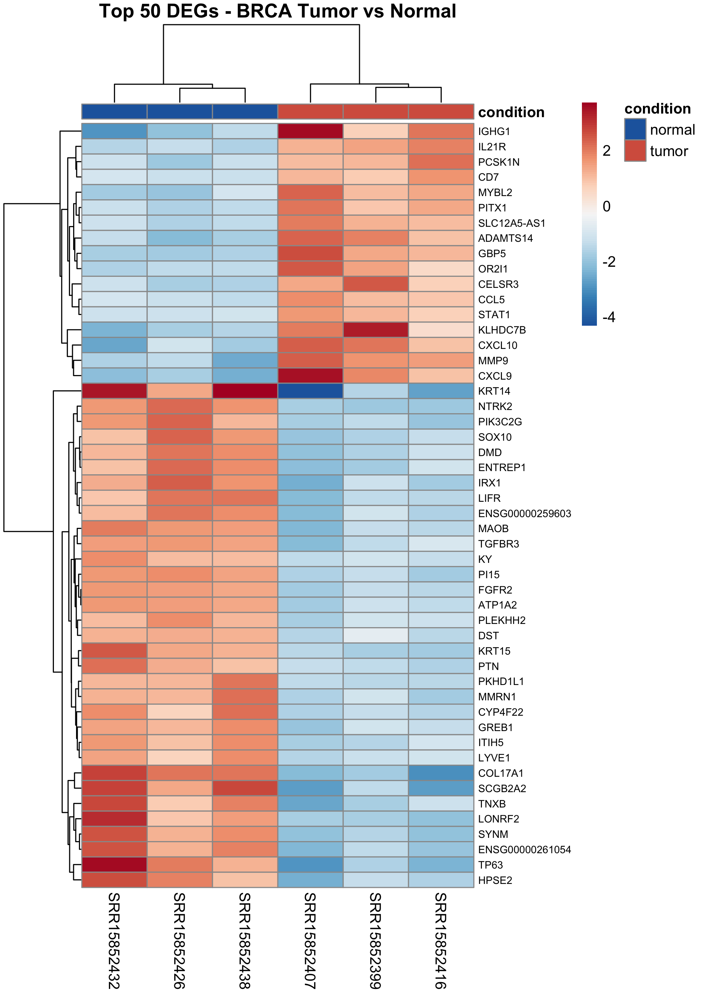
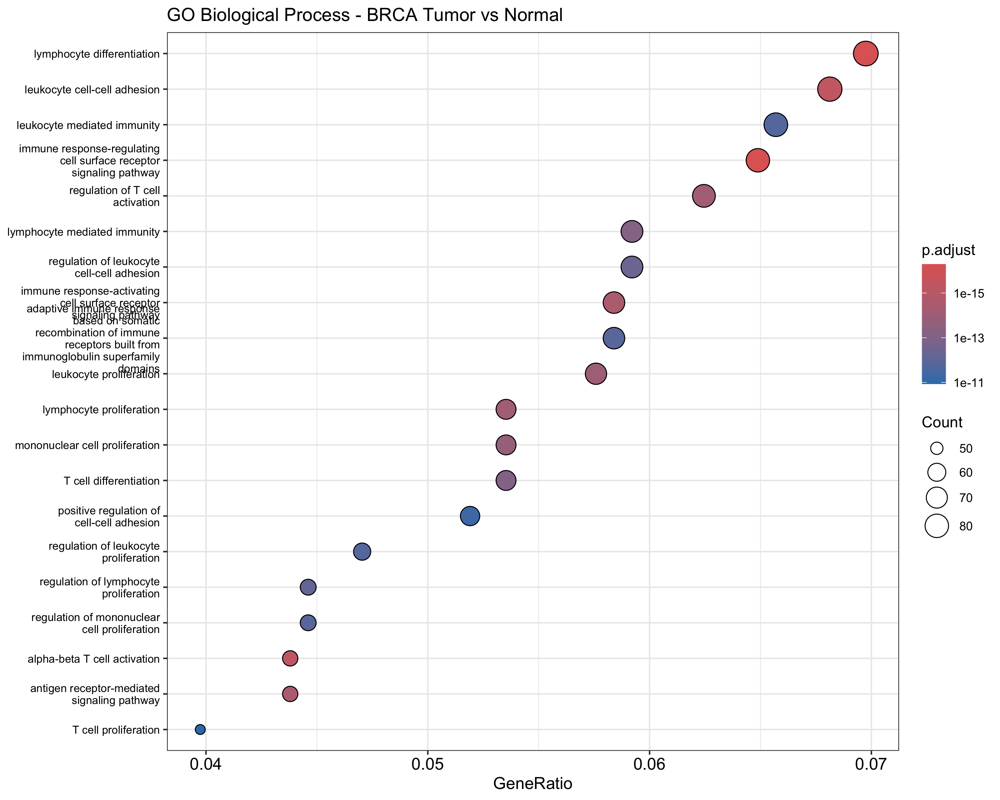
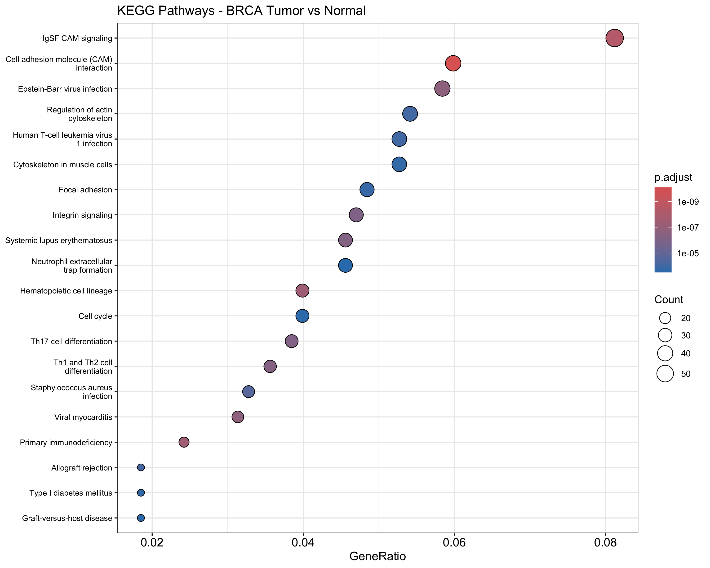
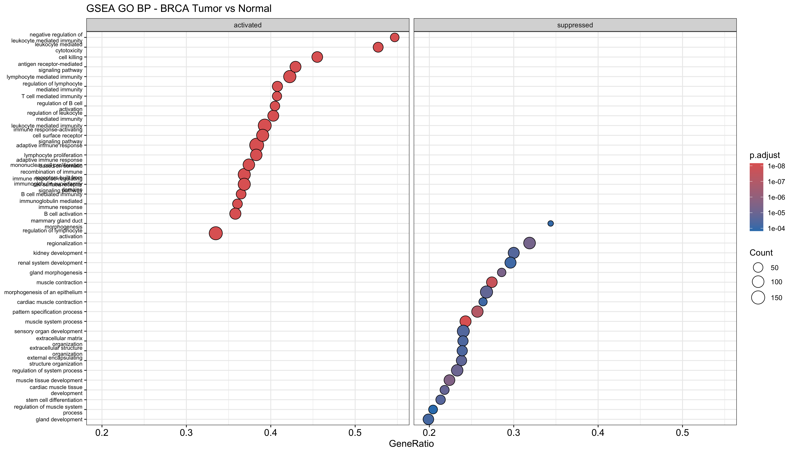

# RNA-seq Pipeline: BRCA Tumor vs Normal

End-to-end bulk RNA-seq analysis pipeline for differential gene expression between breast tumor and matched normal tissue, built from raw FASTQ to pathway enrichment.

**Dataset:** GSE183947 | 6 samples (3 tumor, 3 normal) | Human GRCh38  
**Tools:** FastQC · fastp · STAR · featureCounts · DESeq2 · clusterProfiler  
**Platform:** Local (Mac) + Bridges-2 HPC (PSC)

---

## Pipeline Overview
```
Stage 0 - Download raw FASTQ (SRA/GEO)
Stage 1 - Raw QC (FastQC + MultiQC)
Stage 2 - Adapter trimming (fastp)
Stage 3 - Reference genome + STAR index (GRCh38, Ensembl v109)
Stage 4 - Alignment (STAR)
Stage 5 - Read quantification (featureCounts)
Stage 6 - Differential expression (DESeq2)
Stage 7 - Pathway enrichment (GO, KEGG, GSEA)
```

---

## Key Results

| Metric | Value |
|--------|-------|
| Samples | 3 tumor, 3 normal |
| Genes tested | 19,317 |
| Significant DEGs (padj < 0.05, \|LFC\| > 1) | 1,570 |
| GO BP terms enriched | 837 |
| KEGG pathways enriched | 68 |
| GSEA GO terms | 1,055 |

**Top upregulated genes in tumor:** TP63, NTRK2, KRT14, FGFR2, MMP9  
**Top downregulated genes in tumor:** COL17A1, CXCL10, CXCL9, CCL5, STAT1

---

## Figures

### PCA


### Volcano Plot


### Top 50 DEGs Heatmap


### GO Biological Process Enrichment


### KEGG Pathway Enrichment


### GSEA


---

## Reproduce This Analysis

**Requirements:** conda
```bash
# Clone repo
git clone https://github.com/zahinp7/RNA-seq-BRCA-pipeline.git
cd RNA-seq-BRCA-pipeline

# Create environment
conda env create -f environment.yml
conda activate bioinfo

# Run pipeline (stages 0-5 require ~35Gi disk, run stages 3-5 on HPC)
bash scripts/00_download_data.sh
bash scripts/01_fastqc_raw.sh
bash scripts/02_trim.sh
bash scripts/03_download_reference.sh
bash scripts/03b_star_index.sh       # recommend HPC for this step
bash scripts/04_align.sh
bash scripts/05_featurecounts.sh

# Downstream analysis (R)
Rscript scripts/06_deseq2.R
Rscript scripts/07_pathway_enrichment.R
```

**HPC users (Bridges-2):** See `scripts/align_only.slurm` for SLURM job submission.

---

## Biological Interpretation

PC1 (46% variance) separates tumor from normal, consistent with broad transcriptomic reprogramming in breast cancer. High inter-tumor variance on PC2 reflects expected heterogeneity across patients.

Pathway enrichment reveals two major themes: immune infiltration (lymphocyte differentiation, T cell activation, antigen receptor signaling) and loss of normal tissue programs (mammary gland morphogenesis, extracellular matrix organization, muscle/gland development). These patterns are consistent with published BRCA transcriptomics literature.

---

## Dataset

- **GEO Accession:** [GSE183947](https://www.ncbi.nlm.nih.gov/geo/query/acc.cgi?acc=GSE183947)
- **Reference genome:** Ensembl GRCh38 release 109
- **Samples used:** SRR15852399, SRR15852407, SRR15852416 (tumor) · SRR15852426, SRR15852432, SRR15852438 (normal)